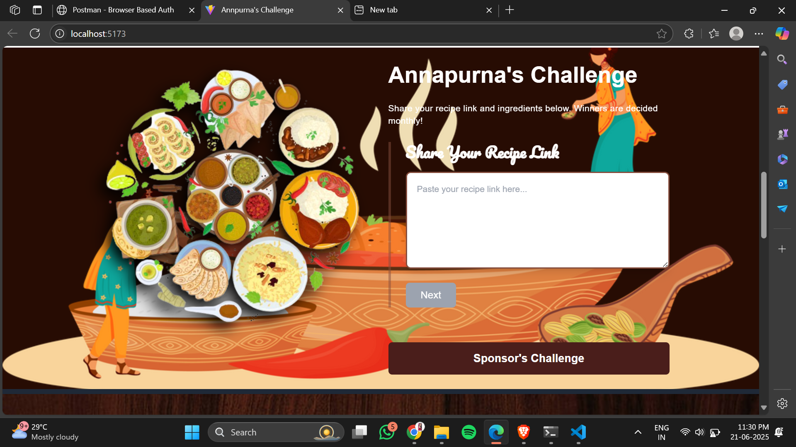
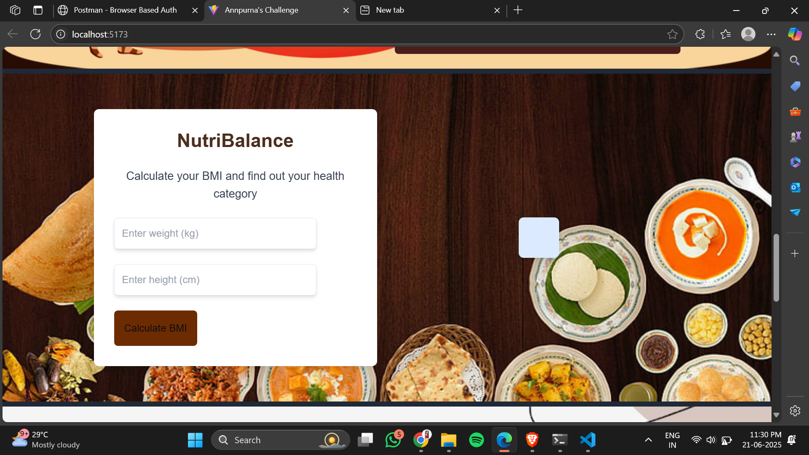

# 🌱 Forked-Found

**Forked-Found** is a food sustainability web application that empowers individuals and communities to reduce food waste by sharing, discovering, and donating excess food.

Built using **React**, **Vite**, and modern web tools, it enables users to connect over surplus food items, find local opportunities for sustainable living, and contribute to the circular food economy.

---

## 🚀 Features

- ♻️ **Share Excess Food**: Post food you don't need, so others can make use of it.
- 📍 **Discover Nearby Listings**: Find available food donations near your location.
- 🧑‍🤝‍🧑 **Community-Driven**: Enable mutual help and food-sharing within your community.
- 🔎 **Search & Filter**: Smart filters to help users find what they need easily.
- 💻 **Responsive UI**: Optimized for desktop and mobile devices.

---

## 🛠️ Tech Stack

| Frontend        | Tool/Library       |
|-----------------|--------------------|
| Framework       | React + Vite       |
| Styling         | CSS / Tailwind (if used) |
| Routing         | React Router (if used) |

📁 Project Structure
Forked-Found/
├── public/
├── src/
│   ├── components/
│   ├── pages/
│   ├── App.jsx
│   └── main.jsx
├── README.md
├── package.json
└── vite.config.js

## 📸 Screenshots

### 🏠 Home Page

### 🍱 Donate Page

### 🔍 Search Page

### 📋 All Listings

